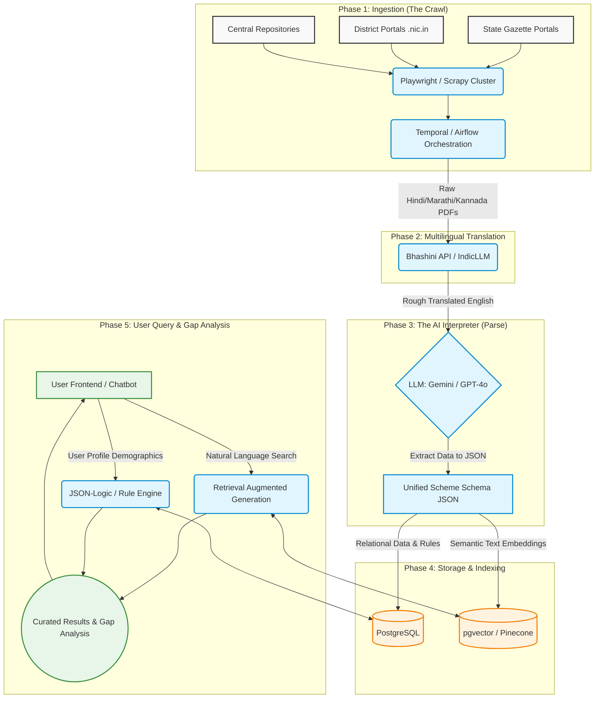

# GovtNavigator - Technical Architecture

**Status:** Architectural Draft | **Phase:** 2 (Data & Architecture Design)

## 1. System Overview
GovtNavigator solves the "cross-state fragmentation" problem by completely decoupling **Data Ingestion** from **User Search**. Instead of live-crawling regional websites upon user request, we employ an asynchronous, multi-stage ETL pipeline that standardizes all data into the Unified Scheme Schema (JSON).

## 2. Global Architecture Diagram

## 3. Recommended Tool-Stack

### 3.1 Data Ingestion & Orchestration
*   **Crawlers:** `Python` + `Scrapy` for standard pages, `Playwright` for dynamic Javascript-heavy regional portals.
*   **Orchestration Engine:** `Temporal` or `Apache Airflow`. This is crucial to manage failures, timeouts, and cron schedules across 700+ unreliable district government websites.

### 3.2 Multilingual Engine
*   **Primary AI Translation:** `Bhashini API` (National Language Translation Mission). Native, deep understanding of "Sarkari" (bureaucratic) terminology across 22 Indic languages.
*   **Fallback:** Open-source `IndicLLM` or Gemini API if Bhashini limits are reached/timed-out.

### 3.3 The "Interpreter" (Parsing)
*   **LLM Provider:** `Gemini 1.5 Pro` or `OpenAI GPT-4o`.
*   **Task:** Uses *Structured Outputs* (function calling) to ingest rough Bhashini translations and output the strict `Unified Scheme Schema` established in Phase 1.

### 3.4 Storage Layer
*   **Relational Database:** `PostgreSQL` (via Supabase or AWS RDS). Perfect for mapping user profiles and storing JSON Schema representations of schemes.
*   **Vector Database:** `pgvector` (as an extension on Postgres) or `Pinecone` for high-throughput semantic search on the actual policy guidelines. 

### 3.5 Rule Engine (Matching Engine)
*   **Logic Execution:** `JSON-Logic` running in a Node.js or Python backend.
*   **Functionality:** Safely compares User payload `{ "age": 28, "caste": "general", "state": "UP" }` against the generated Schema to natively determine **Gap Analysis** without repeatedly invoking LLMs.
